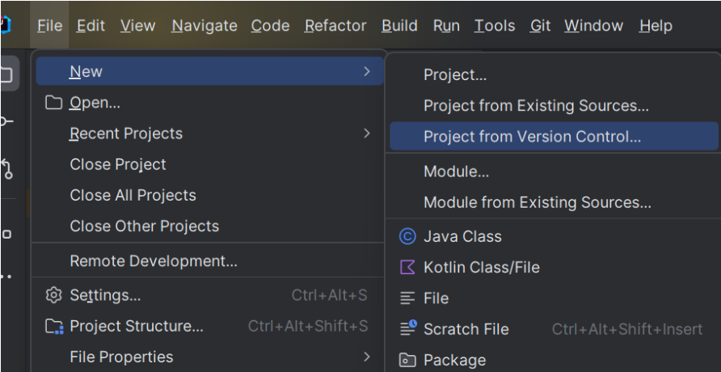
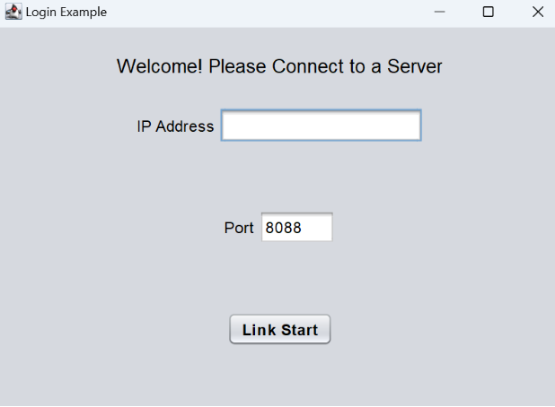
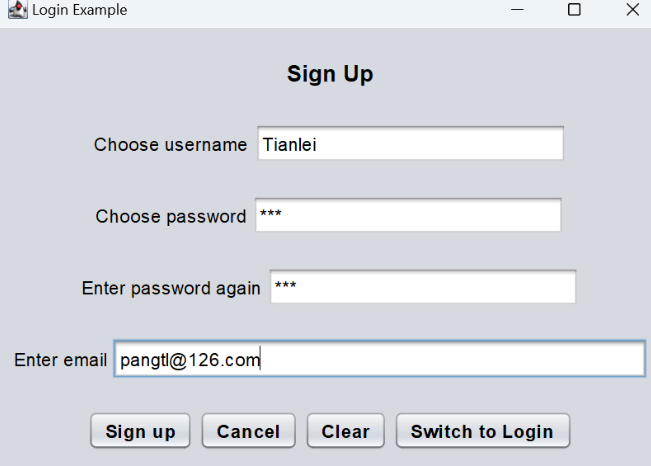
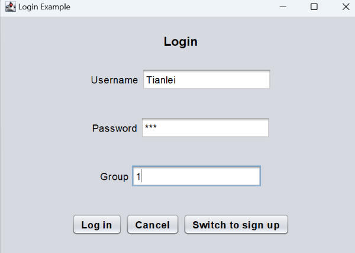
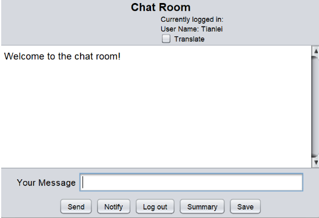

## What is EfficienTalk?

EfficienTalk is an all-in-one collaboration tool that specializes in enhancing team efficiency through a multitude of features such as chatting, data storage, real-time translation, and more. It's designed to be accessible, catering to users with intellectual disabilities.

## Key Features

- **Real-Time Chatting**: Communicate instantly with your team members.
- **Persistent Data Storage**: Automatically stores chat histories for future reference.
- **Language Translation**: Break language barriers with real-time translation.
- ...

## Use Cases

### clear_users
Clears all user data from the local storage.

### connect
Establishes a connection with the server for real-time communication.

### login
Allows a user to log in to their account using their credentials.

### logout
Enables a user to securely log out of the application.

### notify
Sends notifications to users, which can also be sent as email reminders.

### save
Stores conversations, files, or summaries locally or in the cloud.

### send_message
Facilitates sending messages between users or groups.

### signup
Registers a new user to the application with necessary details.

### summary
Generates a concise summary of a conversation or meeting.

### switchtologin
Navigates the user to the login interface from other screens within the app.

### switchtosignup
Navigates the user to the signup interface from other screens within the app.

### translate
Utilizes the Baidu translation API to translate text between various languages.

## Installing
### A note on dependencies
EfficienTalk requires Java 17 to run
### Set up
Clone this Github repository: https://github.com/yulong-wu-jackson/EfficienTalk.git
Open an IDE that you are familiar with. Below, we use screenshots from IntelliJ IDEA as an example.
Select File->New->Project from version control

Paste the repository URL and select “clone”

In the pop-up window, select Trust Project -> Open in new window

## Usage

Firstly, run Server.java under the directory Server\src\app  

After you run Server.java successfully, run ClientApp.java under the directory src\app. Note: this src directory is different from the above src directory.

In the pop-up window, enter a valid IP address and enter the port 8088.For example, if you are using window, click Window Key+R, enter cmd, type ipconfig, copy and paste the ipv4 address shown.

In the Sign up window, choose your username and password, enter a valid email address, then press Sign up.

After signing up, you have an account stored in our database! You will be switched to the login window, where you can enter your username and password, and a random group number(we haven’t fully developed our group function yet) to log in.     

After logging in, you will see a chatroom window. Notice the few buttons here.
The “send” button sends your message to the chat room so that other users logged in to this chat room can see the message.
The “Notify” button is responsible for sending your message to the email addresses of all user accounts stored in our database (given that the email address is valid).
The “Summary” button uses high-level AI to write a summary paragraph of all the messages sent by different users in the chat room.
The “Save” button saves the dialogues in this chat room to a separate text file.
The “Translate” checkbox above translates the content in the chatroom into Chinese.

## Contact
tianlei.pang@mail.utoronto.ca

